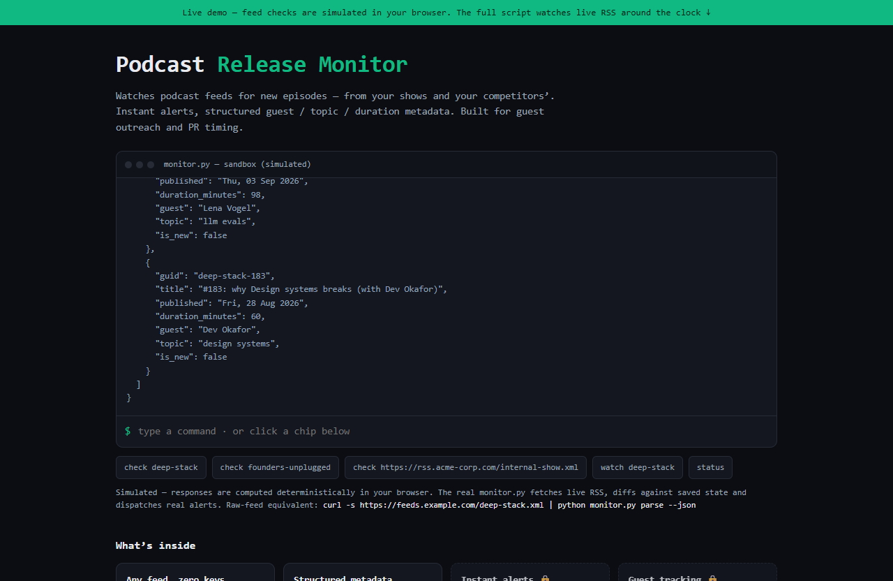

# Podcast Release Monitor — live demo

  

  <a href="https://amos-mig.github.io/podcast-episode-release-monitor-demo/"><strong>▶ Open the live demo</strong></a> ·
  <a href="https://amosmign.gumroad.com/l/podcast-episode-release-monitor"><strong>Get the full product · €29</strong></a>

## What this is

An interactive sandbox of the Podcast Release Monitor CLI: check any podcast feed URL and it computes a simulated 200 response with latency, feed headers, and structured episode JSON (guest, topic, duration, GUID); `watch` adds the show to a watchlist that fires a new-episode alert. Locked cards and a partial watchlist snippet tease the full script's live RSS polling, email/Slack delivery, and guest tracking.

**Try it:** Click the 'watch deep-stack' chip and wait ~5 seconds for the alert, or check any feed URL you can think of.

## What you get in the full product

- RSS-based monitoring of any number of shows
- Instant alerts on new episode publication
- Guest, topic, and duration metadata captured
- Ideal for guest outreach and PR timing
- Single Python file, zero-maintenance operation

## About

- **Storefront:** [kits.amosmignery.dev](https://kits.amosmignery.dev) — single-file products, instant download, commercial license
- **Checkout:** [Gumroad](https://amosmign.gumroad.com/l/podcast-episode-release-monitor) (Merchant of Record, VAT handled)
- **Full product:** [Podcast Release Monitor](https://amosmign.gumroad.com/l/podcast-episode-release-monitor) · €29

## License

The demo page in this repo is MIT-licensed — reuse the technique, not the product.
The **Podcast Release Monitor** itself is not included here and is not free software.
